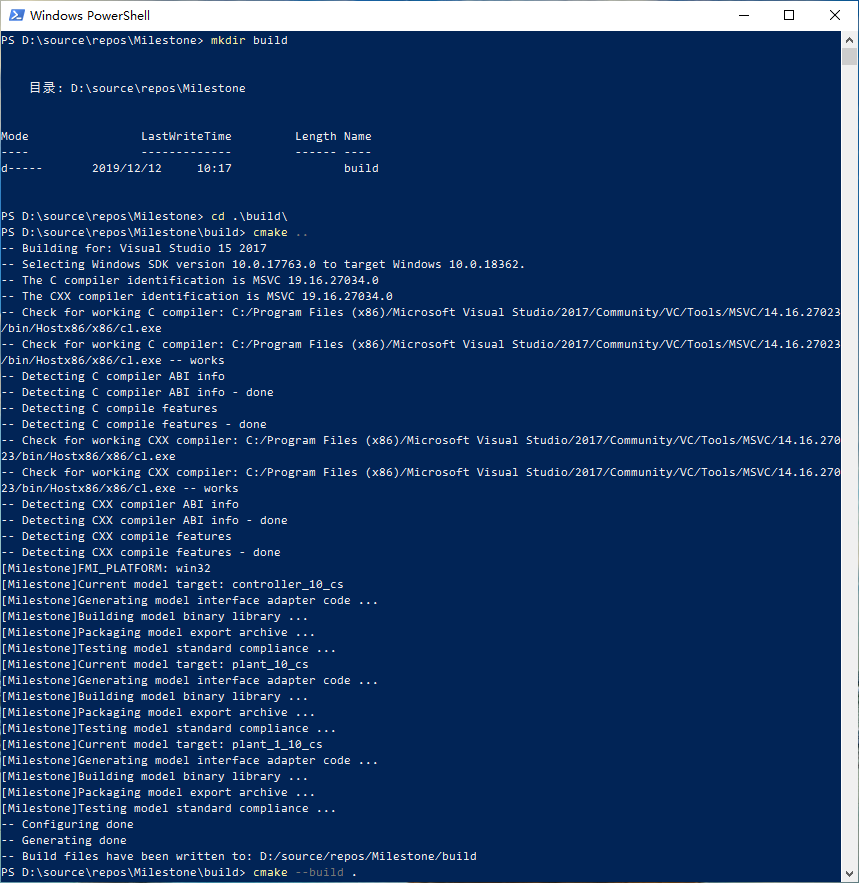
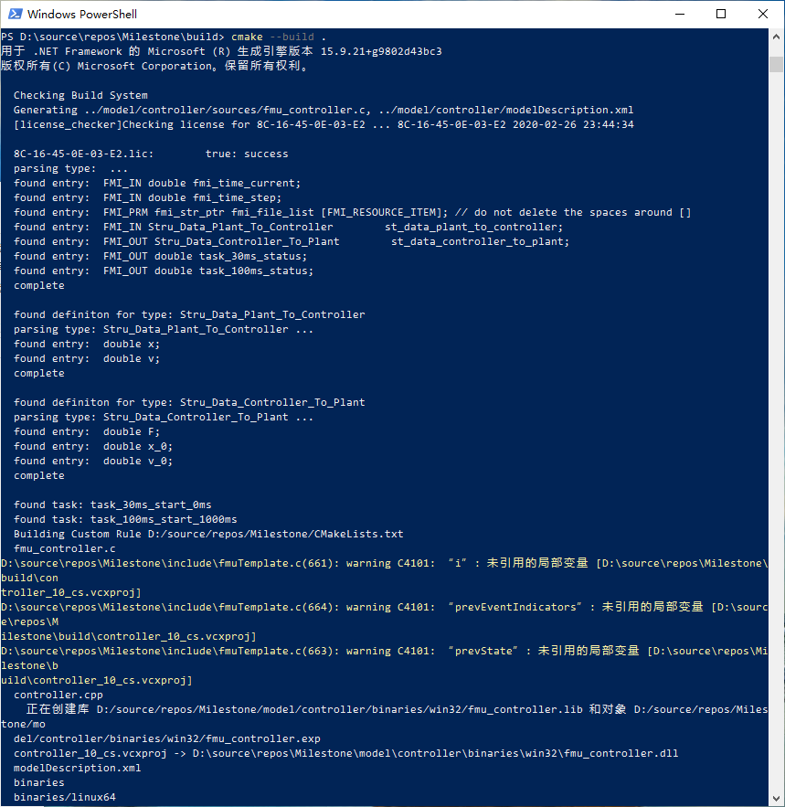
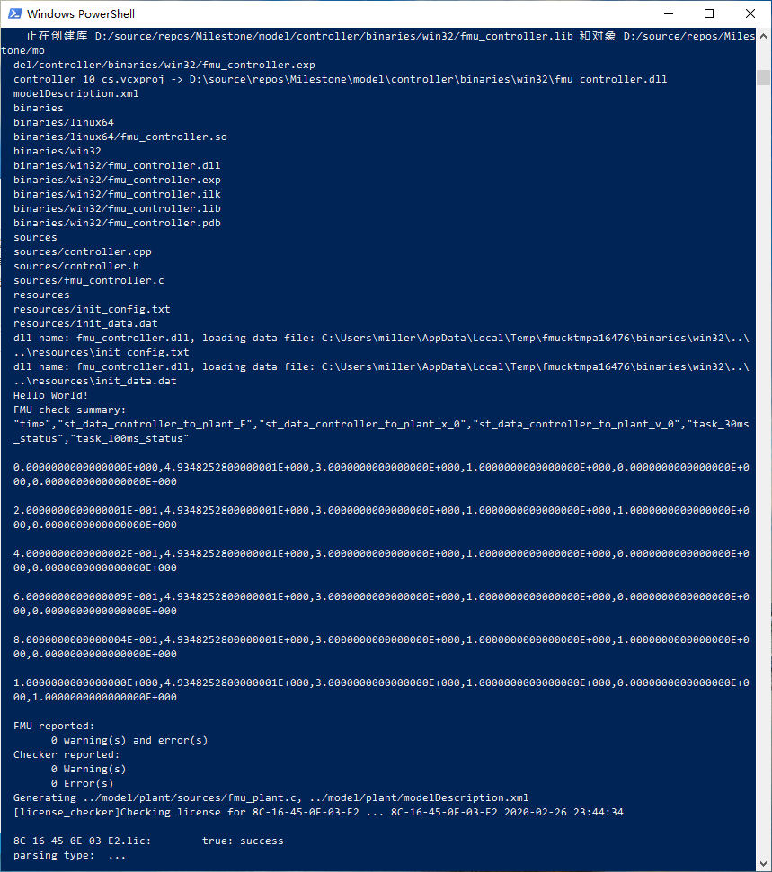

命令行操作
**************************

运行示例
=========

为使开发者从整体上把握工具包的组织方式，这里具体地给出测试用例在CLI中的执行方式如下。

#. 在工具包根目录下执行"mkdir build" //建立单独的构建目录，名称任意，用于将临时文件与工具分开

#. 在工具包根目录下执行"cd build" //切换到创建的构建目录

#. 在创建的构建目录下执行"cmake .." //在构建目录下，指定代码目录在上层目录，生成编译工程文件（Windows下为MSVC sln，Linux下为Makefile）

#. 在创建的构建目录下执行"cmake --build . " //执行构建，注意"."为当前目录，附加"--config Release"或"--config Debug"参数切换Release版和Debug版，默认为Debug版

#. 所导出的fmu模型在export目录中

#. 依次在不同系统下执行工具包，将model目录（保留已生成的中间文件）或整个工具包复制到其他系统继续构建，将获得同时支持多系统的fmu文件

添加模型
========

复制model内部的模型目录结构（内部sources文件夹为必须），实现与模型文件夹同名称的.h及.cpp模型代码文件

若增加新的模型间接口，在model/interface.h中定义接口数据结构体

在顶层CMakeLists.txt中"foreach (MODEL_NAME controller plant plant_1) # add model to this list"语句处，将新的模型添加在列表中

重新执行上述构建操作，系统将执行增量构建

构建模型
========

    创建shadow build目录，生成构建工程（Windows）

    通过CMake执行编译及后处理

    FMU的自动打包和测试