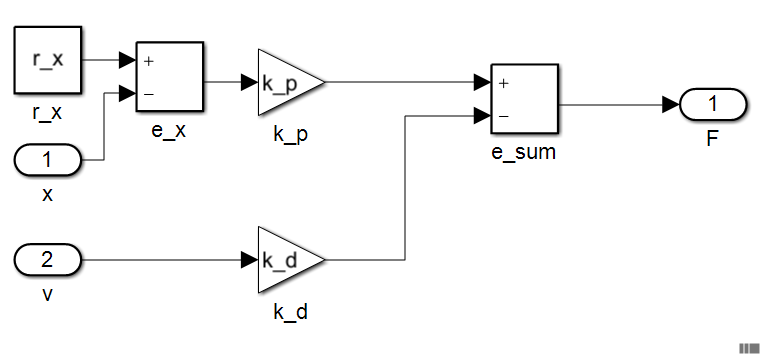

控制器模型
---------------

为实现 :eq:`eq_controller` 中描述的控制器数学模型并与被控对象模型相连接，分解后的控制器原理框图如 :numref:`fig_sys_controller` 。

.. _fig_sys_controller:

    控制器原理框图

模型头文件controller.h的内容：

.. code-block:: C
    :linenos:

    #ifndef CONTROLLER_H__
    #define CONTROLLER_H__

    //==================================================================/
    // Milestone: A test case for fmi simulation tools
    // Copyright (c) 2019, MA Yuhai	
    // All rights reserved.	
    //
    // Version 1.0
    //==================================================================/

    #include "interface.h"

    #define FMI_MODEL_AUTHOR "MA Yuhai"    /* 模型作者 */
    #define FMI_MODEL_NAME "controller"    /* 模型名称 */
    #define FMI_MODEL_DISCRIPTION "a controller model"    /* 模型描述 */
    #define FMI_PORT_POSTFIX ""    /* 端口后缀 */

    // resource file definition if any    /* 外部资源文件需要放置在模型的resources目录下 */
    #define FMI_RESOURCE_ITEM 2    /* 外部资源文件数量定义 */
    #if FMI_RESOURCE_ITEM>0 && defined EN_RES_ACCESS    
    const char *resource_file_list[FMI_RESOURCE_ITEM] = {
        "init_config.txt", "init_data.dat" };    /* 外部资源文件名称定义列表 */
    #endif                                       /* 列表中超出FMI_RESOURCE_ITEM的项目将被忽略 */

    // task definition if any in the unit of [ms]    /* 格式task_[period]ms_start_[offfset]ms */
    #define FMI_TASK_ITEM 2    /* 计划任务数量定义 */
    FMI_EXPORT void task_30ms_start_0ms(void);    /* 计划任务触发函数1 */
    FMI_EXPORT void task_100ms_start_1030ms(void);    /* 计划任务触发函数2 */

    // define interface variables by an fmi object
    // one statement per line, no extra semicolons allowed
    // do not modify internal variables
    typedef struct st_fmi_object_t {
        // internal variables    /* 必须的内部变量，当前时间、步长和文件列表 */
        FMI_IN double fmi_time_current;
        FMI_IN double fmi_time_step;
    #if FMI_RESOURCE_ITEM>0
        FMI_PRM fmi_str_ptr fmi_file_list[FMI_RESOURCE_ITEM];    /* 运行时可用的外部资源文件名列表 */
    #endif

        // interface variables
        FMI_IN Stru_Data_Plant_To_Controller st_data_plant_to_controller;    /* 输入接口结构体 */
        FMI_OUT Stru_Data_Controller_To_Plant st_data_controller_to_plant;    /* 输出接口结构体 */
        FMI_OUT double task_30ms_status;    /* 自定义输出1，30ms任务监控 */
        FMI_OUT double task_100ms_status;    /* 自定义输出2，100ms任务监控 */
    }st_fmi_object;    /* 模型名称 */
    #endif // CONTROLLER_H__

模型源文件controller.cpp中的内容：

.. code-block:: C
    :linenos:

    #include "controller.h"
    #include <iostream>    /* 不限制模型内部的实现方式，可以使用C++的类、STL等特性 */
    #include <fstream>
    #include <string>
    using namespace std;

    double x;    /* 可以在模型内部自定义全局变量 */
    double v;
    double F;
    double x_0;
    double v_0;
    int task_30ms_trigger;
    int task_100ms_trigger;

    void load_initial_data(fmi_str_ptr fmi_file_list[])    /* 可以在模型内部自定义函数 */
    {
        ifstream init_file;

        init_file.open(fmi_file_list[0]);
        if (!init_file.is_open()) {
            cout << "open data file error: " << fmi_file_list[0] << endl;
        }
        else {
            string buff;
            getline(init_file, buff);
            cout << buff << endl;    /* 打印资源文件中的内容 */
        }

        init_file.close();

        init_file.open(fmi_file_list[1]);
        if (!init_file.is_open()) {
            cout << "open data file error: " << fmi_file_list[1] << endl;
        }
        else {
            init_file >> x_0;    /* 读取资源文件中的内容作为初始值传递给被控对象 */
            init_file >> v_0;    /* 注意！一般情况下这并不会生效，和求解器的实现方式有关 */
        }    /* 一般情况下，初始化阶段不会按照模型的连接关系按顺序执行，并交换接口变量 */

        init_file.close();
        return;
    }

    void task_30ms_start_0ms(void)    /* 头文件中定义的定时任务触发函数必须实现 */
    {
        task_30ms_trigger = task_30ms_trigger ? 0 : 1;
    }

    void task_100ms_start_1030ms(void)
    {
        task_100ms_trigger = task_100ms_trigger ? 0 : 1;
    }

    void* fmi_instantiate(void)    /* 实例化函数，在模型加载后被调用 */
    {
        st_fmi_object *p =    /* 模板内容均为必须的操作，请勿删除 */
            (st_fmi_object *)calloc(1, sizeof(st_fmi_object));
        if (!p) {
            fprintf(stderr, "fmi_instantiate failed in model controller!\n");
            exit(EXIT_FAILURE);
        }
        /* 在模板代码后，可添加自定义的操作，如打印信息 */
        return p;
    }

    int fmi_initialize(void *fmi_object)    /* 初始化函数，在模型启动或重置时被调用 */
    {
        st_fmi_object *p = (st_fmi_object *)fmi_object;

        load_initial_data(p->fmi_file_list);    /* 可通过p指针访问接口上的所有变量及文件资源 */
        p->st_data_controller_to_plant.x_0 = x_0;
        p->st_data_controller_to_plant.v_0 = v_0;

        return 0;
    }

    int fmi_doStep(void *fmi_object)    /* 步进函数，每一个步长推进的周期被调用 */
    {
        st_fmi_object *p = (st_fmi_object *)fmi_object;
        const double pi = 3.1416;    /* 可在模型中自定义参数常量 */
        const double r_x = 5;
        const double m = 0.1;

        const double zeta = 0.2; // let it oscillates
        const double omega_n = 2*pi*0.5;
        const double k_p = omega_n*omega_n*m;
        const double k_d = 2*zeta*omega_n*m;

        x = p->st_data_plant_to_controller.x;    /* 可选择将接口内存变量赋值到较方便的名称 */
        v = p->st_data_plant_to_controller.v;

        F = k_p * (r_x - x) - k_d * v;    /* 执行模型计算 */

        p->st_data_controller_to_plant.F = F;    /* 将计算后的结果发布到接口内存上 */
        p->task_30ms_status = task_30ms_trigger;
        p->task_100ms_status = task_100ms_trigger;

        return 0;
    }

    int fmi_reset(void *fmi_object)    /* 复位函数，在重置模型时被调用 */
    {
        st_fmi_object *p = (st_fmi_object *)fmi_object;
        IO_PORT_FLUSH(Stru_Data_Controller_To_Plant, st_data_controller_to_plant);    /* 清空输出接口内存 */
        return 0;
    }

    void fmi_freeInstance(void *fmi_object)    /* 释放函数，在模型卸载时被调用 */
    {
        st_fmi_object *p = (st_fmi_object *)fmi_object;

        free(p);
    }