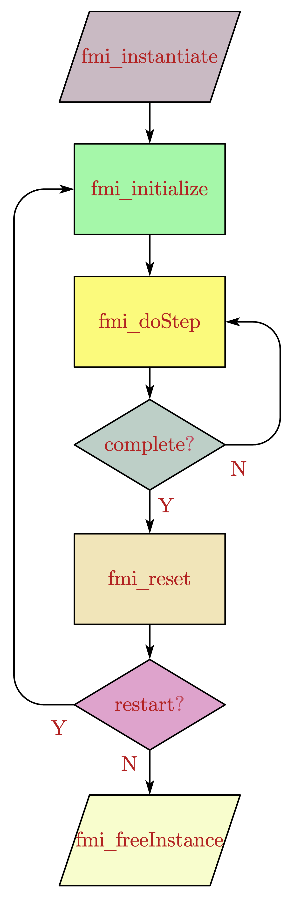

.. _sec_fmi:

FMI接口及其实现
**********************

本工具在FMI接口代码的基础上，简化了多数固有的流程性代码以及繁琐的接口定义操作，并添加了一些实用功能，代码模板的运行流程如 :numref:`fig_flow` 。代码的实现请阅读 :ref:`sec_code` 相关注释。

.. _fig_flow:

    模型代码模板运行流程

.. _sec_code:

代码结构剖析
============

.. toctree::
    
    interface
    controller
    plant