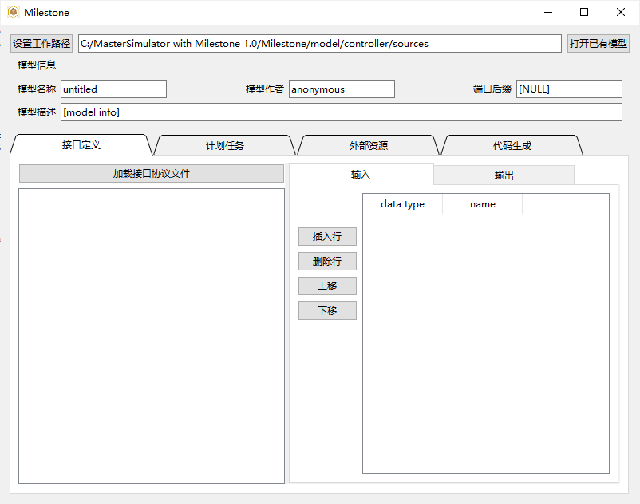

新建模型并生成模板
===================

请先参考编辑模型的操作，如 :ref:`sec_edit` 。

若要全新创建模型，请先备份并复制示例模型的全局接口头文件与模型目录结构，编辑全局接口头文件中的接口数据类型定义；
然后，选择工作路径到工具包中创建好的模型代码目录：点击“*设置工作路径*”按钮，打开系统的路径选择对话框，拾取工具包中的model/model_name/sources目录，如 :numref:`fig_g_1` 。
然后，通过界面中的相应区域，填写模型头文件中的信息，生成代码模板，其他操作同编辑已有模型。

.. _fig_g_1:

    设置工作路径