.. _sec_edit:

打开已有的模型头文件
====================

通过界面中的相应区域，修改从模型头文件中载入的信息。

* 点击“*打开已有模型*”按钮，打开系统的文件选择对话框，拾取模型的头文件，如 :numref:`fig_g_2` 。

.. _fig_g_2:
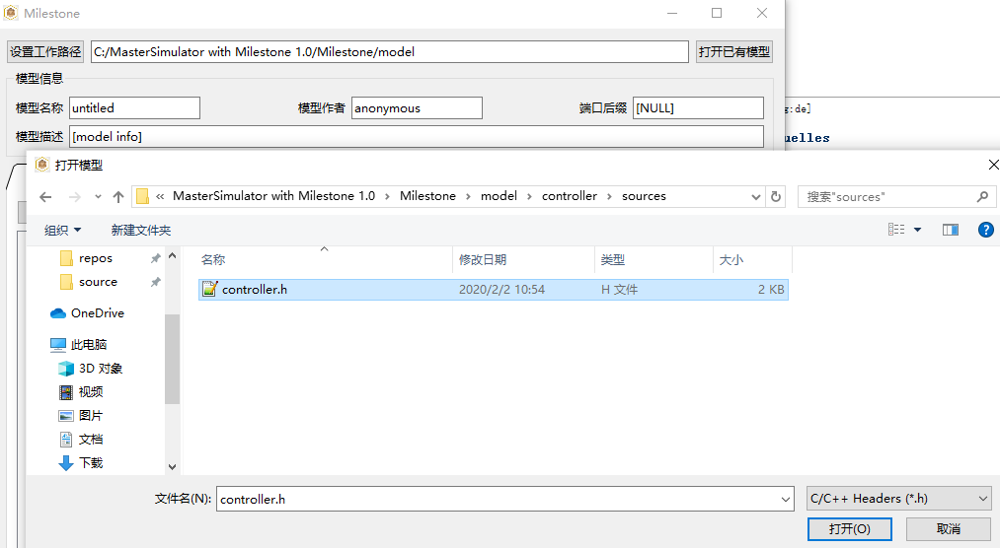

    打开已有模型   

* 点击“*加载接口协议文件*”按钮，打开系统的文件选择对话框，拾取interface.h全局接口头文件，如 :numref:`fig_g_3` 。

.. _fig_g_3:
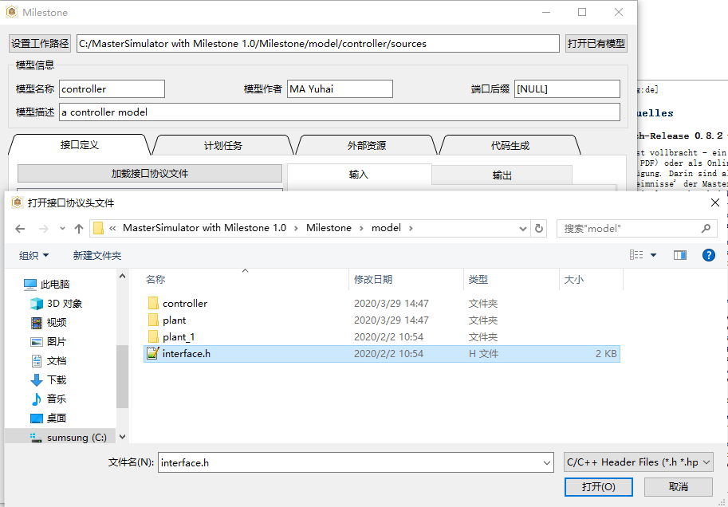

    加载接口协议文件

* 从左侧列表解析出的接口数据结构中，点选拖动结构体定义到右侧输入、输出接口定义区域，如 :numref:`fig_g_4` 。

.. _fig_g_4:
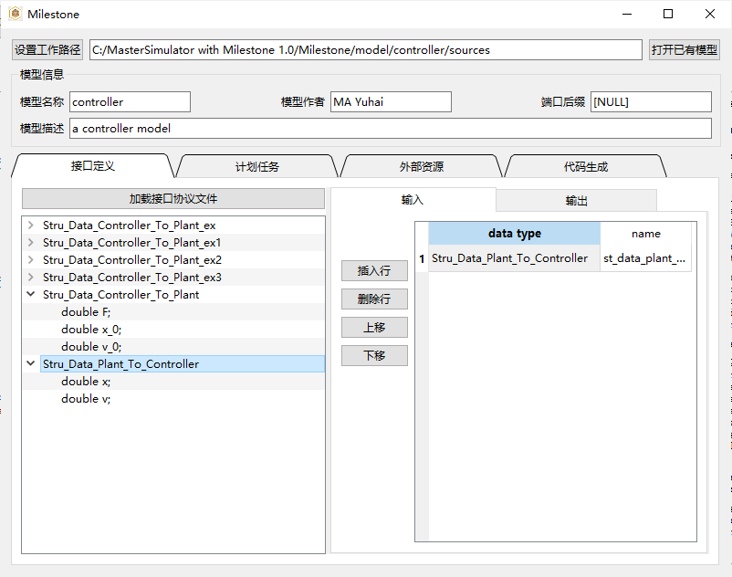

    拖动结构体定义到输入

* 也可以直接键入接口定义表格中的内容，录入后可以通过中间的编辑按钮，对输入、输出列表中的行数据进行编辑，如 :numref:`fig_g_5` 。

.. _fig_g_5:
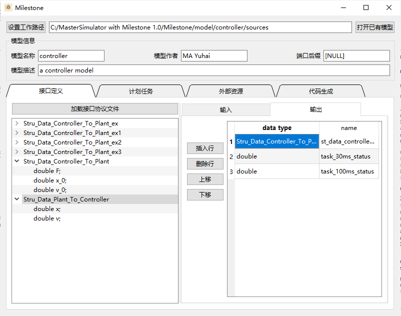

    拖动结构体定义到输出 

* 点击上方标签页，切换至“*计划任务*”，如 :numref:`fig_g_6` 。其中task ID为可选的录入区域，系统会自动从零开始编号；按照表头键入任务的定时周期和启动偏移时间；左侧的编辑按钮可对已经录入的行进行整体编辑。

.. _fig_g_6:
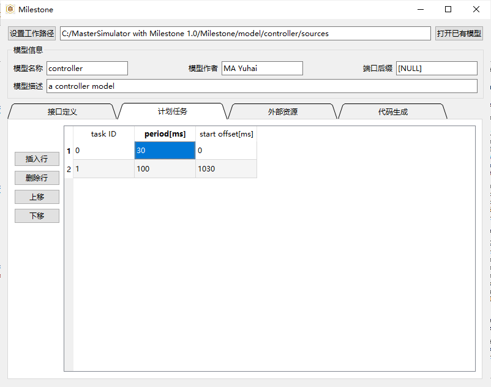

    定义计划任务   

* 点击上方标签页，切换至“*外部资源*”，如 :numref:`fig_g_7` 。其中resource ID为可选的录入区域，系统会自动从零开始编号；按照表头键入资源文件的文件名（运行时文件需要预先放置到模型的resources目录）；左侧的编辑按钮可对已经录入的行进行整体编辑。

.. _fig_g_7:
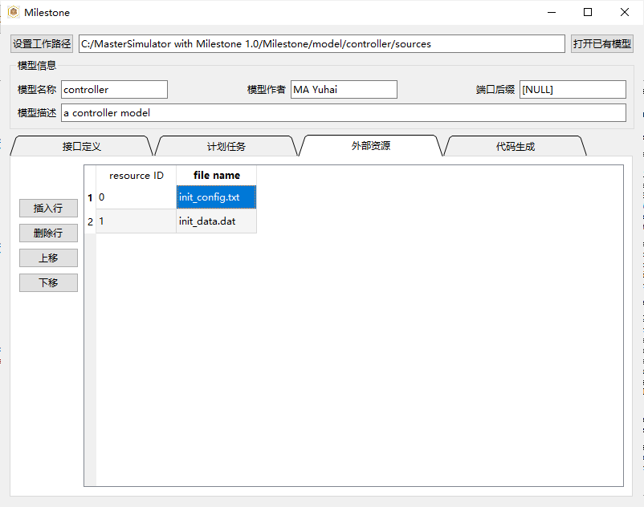

    定义外部资源

* 点击上方标签页，切换至“*代码生成*”。点击“*生成代码*”将在当前工作路径生成模型的头文件和源文件模板，对于打开的已有模型，仅更新头文件，不会覆盖已经实现的模型源文件，并给出提示，如 :numref:`fig_g_8` 。

.. _fig_g_8:
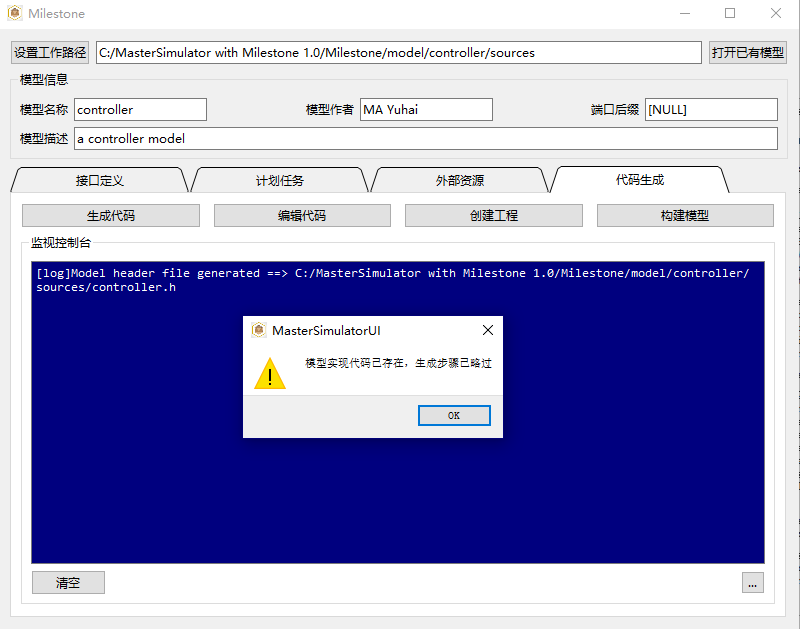

    生成代码   

* 点击“*编辑代码*”，将使用配置中选择的编辑器打开已经生成的模型头文件和源文件，如 :numref:`fig_g_9` 。

.. _fig_g_9:
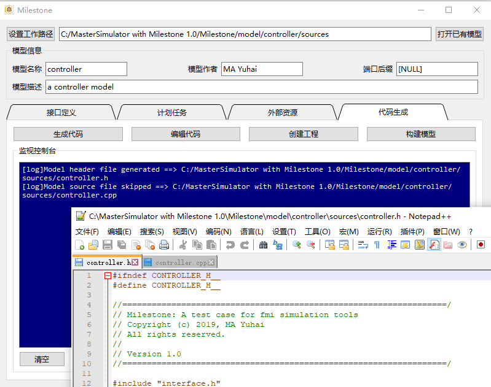

    编辑代码

* 点击“*创建工程*”，弹出模型选择对话框，在列表中选择需要构建的模型，如 :numref:`fig_g_10` 。确定后开始创建工程。

.. _fig_g_10:
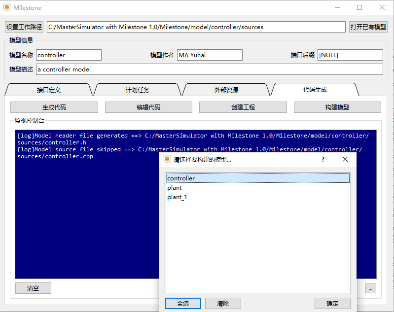

    选择要构建的模型   

* 观察创建工程过程中控制台输出的信息，如 :numref:`fig_g_11` ，请确认对系统中编译环境的测试是否通过。

.. _fig_g_11:
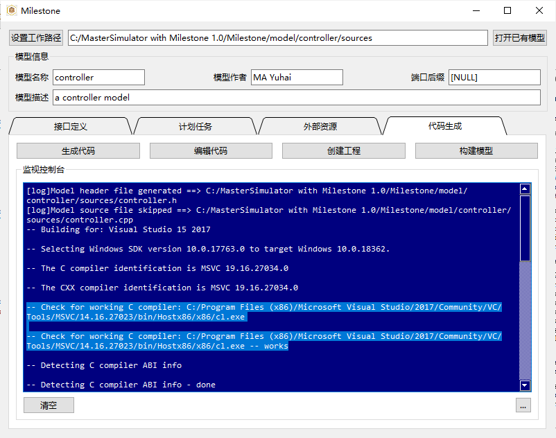

    开始创建，确认编译环境测试通过

* 构建完成后控制台输出信息结束，如 :numref:`fig_g_12` 。

.. _fig_g_12:
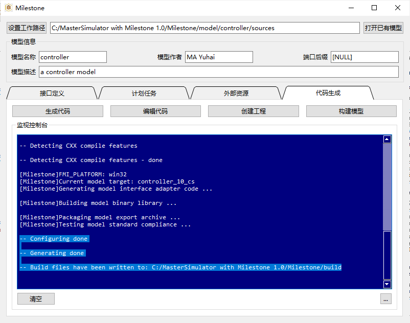

    完成创建，确认生成编译工程

* 点击“*构建模型*”，开始编译、模型打包与测试过程，如 :numref:`fig_g_13` 。请确认工具包授权检测通过，并生成了相关文件。

.. _fig_g_13:
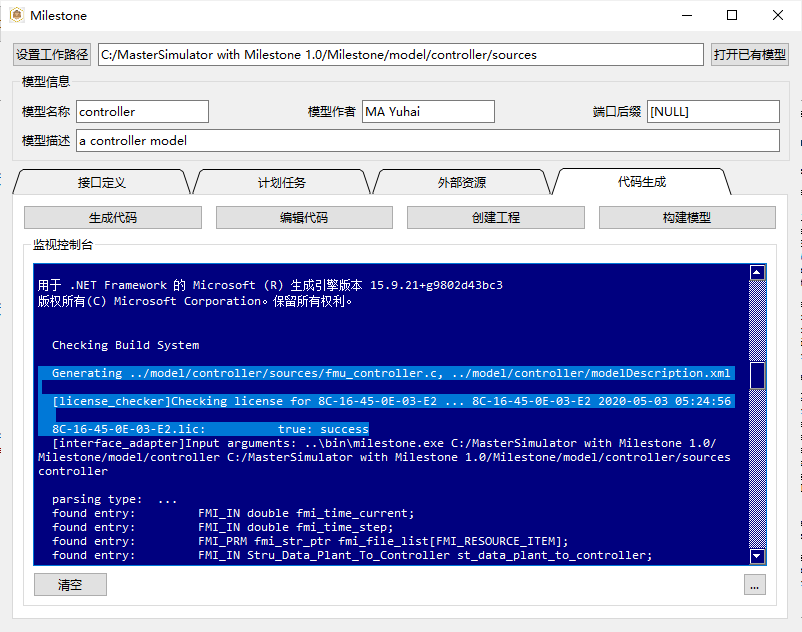

    开始构建，确认授权通过

* 构建完成后将对生成的FMU进行零输入测试，给出运行报告，如 :numref:`fig_g_14` 。

.. _fig_g_14:
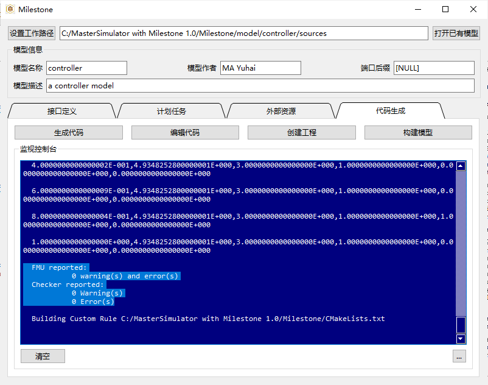

    完成构建，确认测试通过