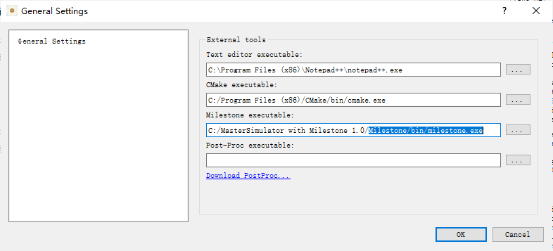
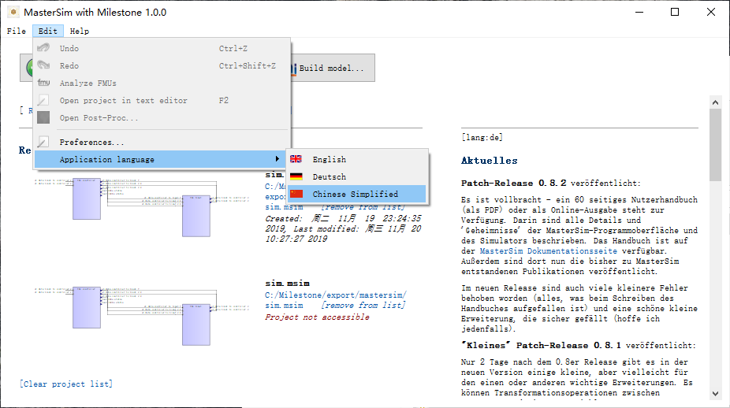

外部依赖环境配置
================

编译器
------

Windows
^^^^^^^
推荐Visual Studio中的cl编译器，注意不要使用绿色安装。示例代码在VS2010及以上版本中经过测试，但推荐使用VS2013及以上的版本，以支持C99中的编码习惯。

Linux
^^^^^
推荐使用gcc/g++或clang/clang++编译器，推荐在系统的包管理器中安装。
在Linux下使用图形界面需要配置Qt运行环境，若系统的Qt环境不满足要求，可单独安装Qt开发环境，并在运行GUI程序前设置环境变量：
export LD_LIBRARY_PATH=/home/user/Qt5.12.5/5.12.5/gcc_64/lib/ （*应替换为用户本地的安装路径*）
然后，执行GUI程序
./MasterSimulatorUI

CMake
------
开发工具包执行需要部署CMake运行环境。
此外Windows下还要部署VC++运行时环境。
完整版工具包的env中包含相应的安装文件。
Linux下，需要授予bin目录下程序执行权限（chmod 777 ./bin/\*）。

路径配置
--------
在MasterSim中选择当前系统中安装的CMake路径以及milestone可执行文件的路径，如 :numref:`fig_setting` 。

.. _fig_setting:

    配置Milestone相关工具路径

切换界面语言
------------
在MasterSim中切换Milestone的界面语言，重新启动后生效，如 :numref:`fig_language` 。

.. _fig_language:

    设置Milestone界面语言

