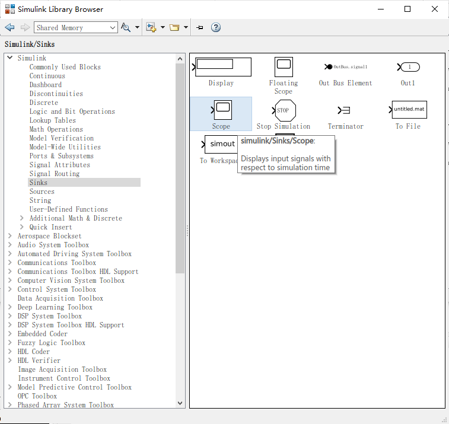

S-Function接口及其实现
*************************

生成fmu的过程中，在模型的sources目录中也生成了支持Simulink导入的S-Function接口代码。

若要生成模型的S-Function模块，在顶层SFcnLists.m中"model_list = {'controller', 'plant'}; % add model to this list"语句处，将新的模型添加在列表中。

启动MATLAB，将工作路径切换至工具包根目录，运行SFcnLists.m脚本，将执行S-Function的代码生成和模块构建。

保存获得的Simulink模型模块，以及工作空间中的数据总线定义，分发模型时还需要附加\*.mexw32/\*.mexw64二进制文件，以及模型所需的数据文件。

下面的示例仍以教程中的模型为例，演示使用S-Function模块进行集成仿真的具体过程。

* 运行SFcnLists.m脚本后，将一一生成列表中模型对应的S-Function模块，如 :numref:`fig_s_0` 。

.. _fig_s_0:

    生成的S-Function模块

* 在MATLAB的工作空间(Workspace)中，将生成的总线(Bus)定义备份，如 :numref:`fig_s_1` 。

.. _fig_s_1:

    工作空间中的总线数据定义

* 在模型对应的代码目录(sources)下，将生成的S-Function所对应的二进制文件一一备份，如 :numref:`fig_s_2` 。

.. _fig_s_2:

    S-Function所对应的二进制文件   

* 在Simulink中将多个S-Function模型连接为仿真工程，并显示其间的总线数据流，如 :numref:`fig_s_3` 。

.. _fig_s_3:

    Simulink中集成生成的S-Function模型

* 此时若直接运行仿真工程，可能出现代数环错误，如 :numref:`fig_s_4` 。

.. _fig_s_4:

    代数环错误      

* 在Simulink模块库中，找到并添加“*Memory*”模块到工程中，如 :numref:`fig_s_5` 。

.. _fig_s_5:

    Memory模块

* 在Simulink模块库中，找到并添加“*Scope*”模块到工程中，如 :numref:`fig_s_6` 。

.. _fig_s_6:

    Scope模块   

* 在Simulink模块库中，找到并添加“*Bus Selector*”模块到工程中，如 :numref:`fig_s_7` 。

.. _fig_s_7:

    Bus Selector模块

* 将Bus Selector模块拖放到plant输出的数据总线上，点击选择要析取的信号，如 :numref:`fig_s_8` 。

.. _fig_s_8:

    通过Bus Selector析信号

* 打开Simulink的仿真求解器配置页面，设置定步长求解器，步长0.005s，如 :numref:`fig_s_9` 。

.. _fig_s_9:

    仿真求解器配置

* 将备份的总线数据结构文件(.mat)导入到工作空间中，并将S-Function的二进制文件复制到工程当前路径下，如 :numref:`fig_s_10` 。

.. _fig_s_10:

    准备总线及二进制文件

* 将模型依赖的其他数据文件复制到工程当前路径下，如 :numref:`fig_s_11` 。

.. _fig_s_11:

    准备数据文件      

* 配置好的Simulink仿真工程及仿真结果，如 :numref:`fig_s_12` 。

.. _fig_s_12:

    Simulink仿真结果   

* 模型中打印到标准输出的调试信息，被重定向至Simulink状态栏中部的诊断监视窗口，如 :numref:`fig_s_13` 。

.. _fig_s_13:

    Simulink诊断监视窗口