示例教程
********

运行示例
========

在了解仿真模型实现的细节之前，可以使用工具包自带的测试用例验证环境部署的正确性，我们先在GUI中快速完成这些操作。

* 运行MasterSimulatorUI.exe，启动MasterSim主界面，如 :numref:`fig_t_0` 。

.. _fig_t_0:
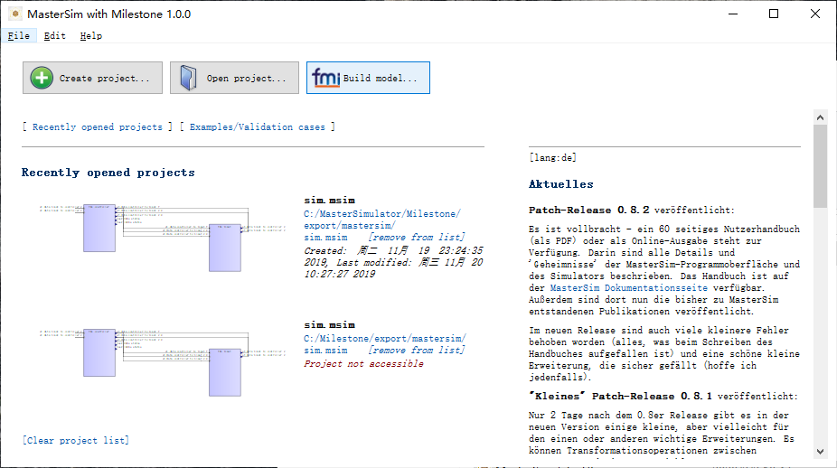

    MasterSim主界面

* 点击“*Build model*”，打开Milestone工具主界面，如 :numref:`fig_t_1` 。

.. _fig_t_1:
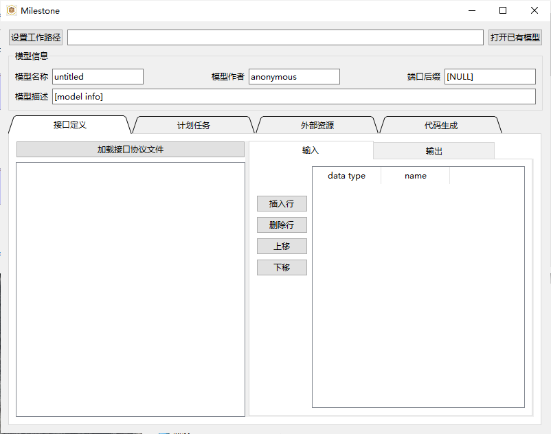

    Milestone主界面

* 此处我们直接运行示例模型，切换至“*代码生成*”标签页，点击“*创建工程*”，如 :numref:`fig_t_2` 。

.. _fig_t_2:
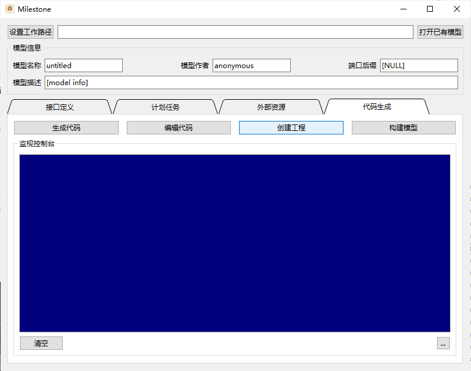

    创建工程   

* 弹出模型选择对话框，在模型列表中选择controller和plant模型，如 :numref:`fig_t_3` 。

.. _fig_t_3:
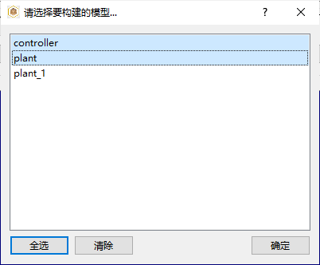

    选择模型

* 点击“*创建工程*”，完成编译工程的创建，如 :numref:`fig_t_4` 。

.. _fig_t_4:
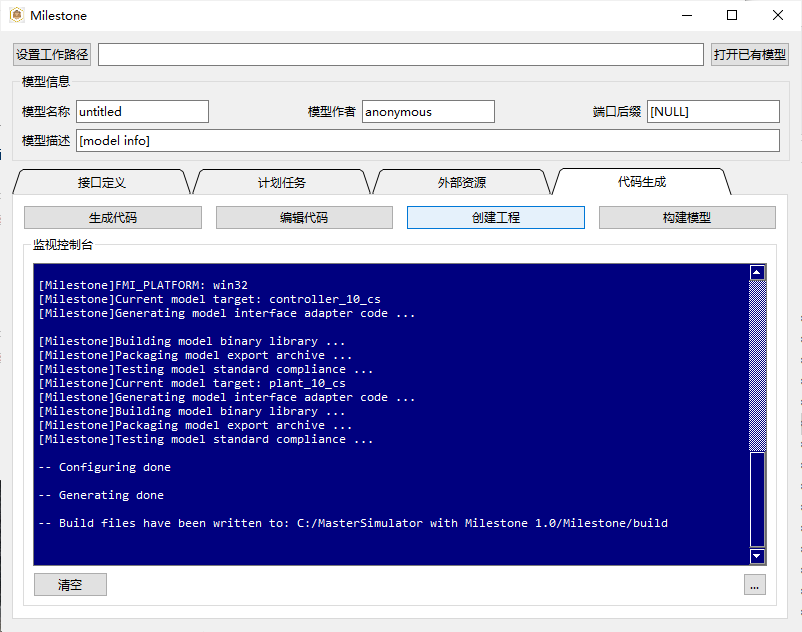

    完成编译工程创建      

* 点击“*构建模型*”，调用系统的编译环境，如 :numref:`fig_t_5` 。

.. _fig_t_5:
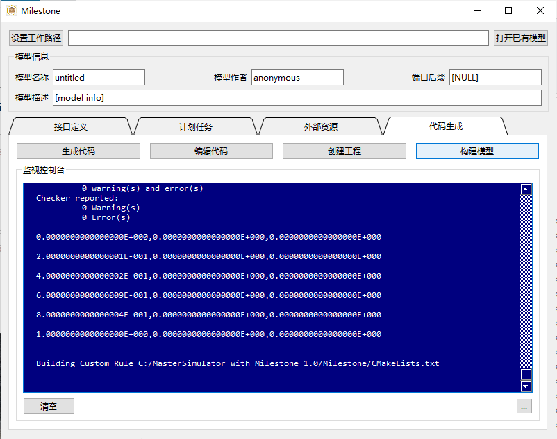

    构建模型

* 在工具包的export目录中，查看生成的FMU文件，如 :numref:`fig_t_6` 。

.. _fig_t_6:
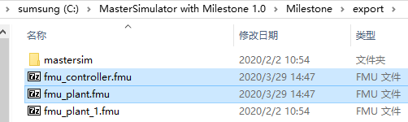

    查看导出的FMU   

* 在MasterSim主界面中打开自带的测试工程，如 :numref:`fig_t_7` 。

.. _fig_t_7:
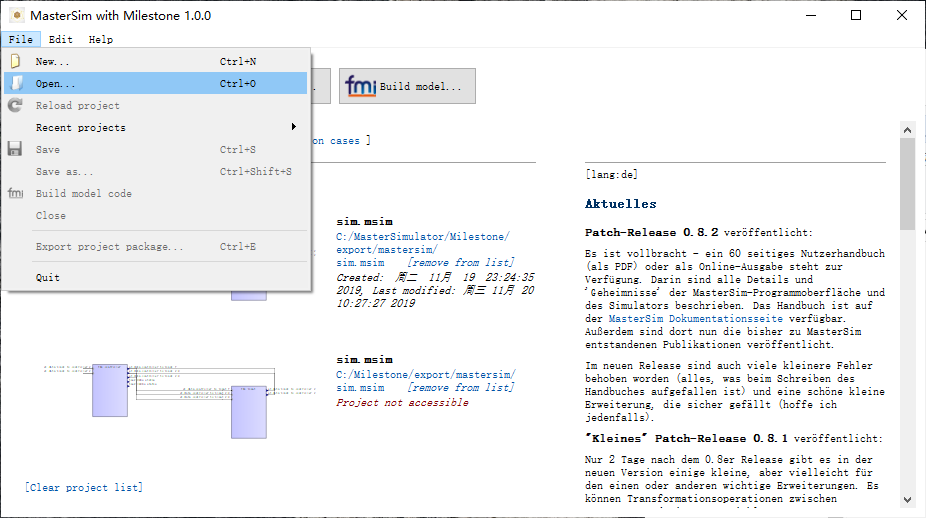

    打开MasterSim测试工程

* 测试工程在export/mastersim路径下，如 :numref:`fig_t_8` 。

.. _fig_t_8:
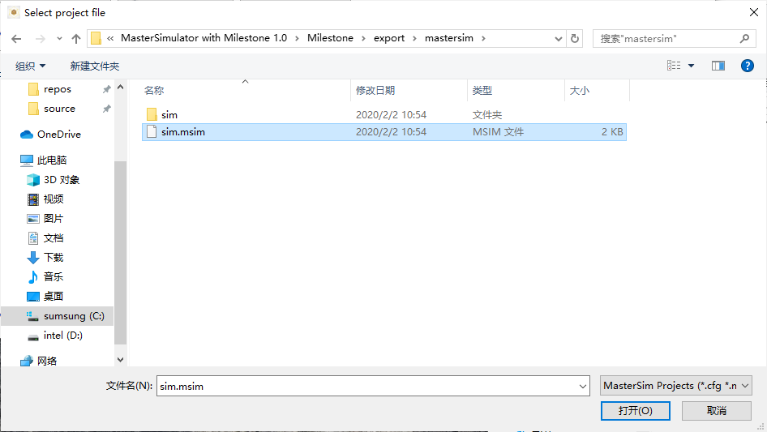

    测试工程默认路径   

* 我们这里重新生成了其中的FMU模型，但他们的连接保持测试工程中的关系不变，如 :numref:`fig_t_9` 。

.. _fig_t_9:
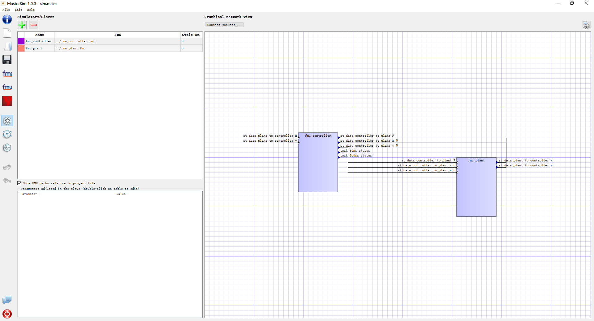

    MasterSim中的模型连接

* MasterSim左侧的功能选择按钮可以启动Milestone，测试FMU中的信息，启动后处理程序，以图或表格的方式配置模型间的连接，以及配置仿真求解器参数等，请参考其 `官方文档 <https://bauklimatik-dresden.de/mastersim/html_en/MasterSim_manual.html>`_ 获得更详细的信息。此处可直接使用示例中配置好的参数，点击“*开始仿真*”按钮，如 :numref:`fig_t_10` 。

.. _fig_t_10:
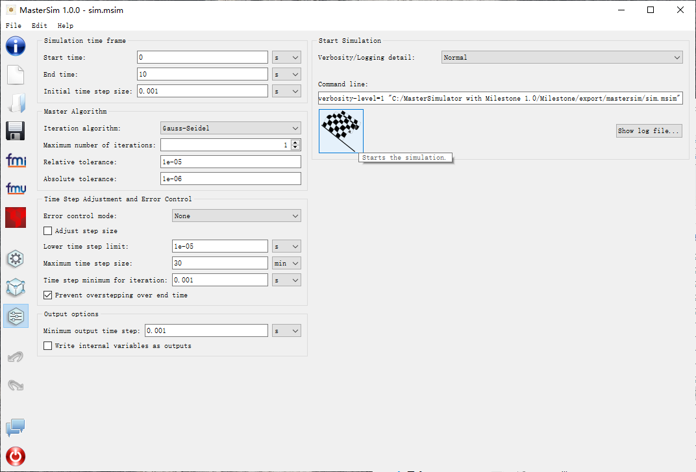

    MasterSim中的仿真配置   

* 观察仿真器的监控信息，以及打印模型中输出的信息，如 :numref:`fig_t_11` 。

.. _fig_t_11:
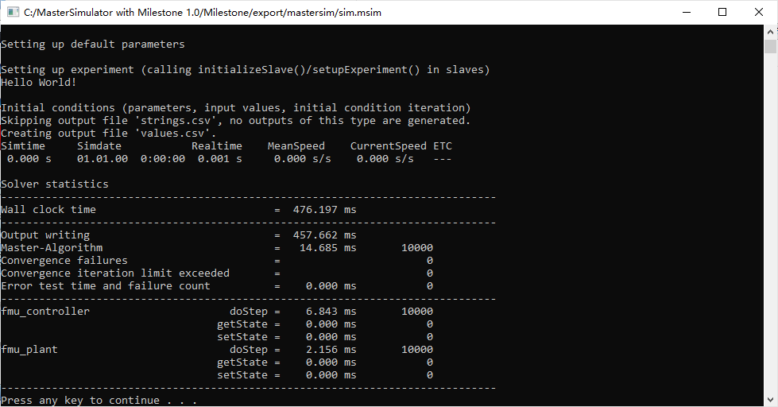

    MasterSim仿真过程监控

* 生成的结果数据文件存放在results路径下，如 :numref:`fig_t_12` 。

.. _fig_t_12:
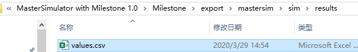

    MasterSim仿真结果路径      

* 识别该csv文件的分隔符，用Excel等工具格式化查看，如 :numref:`fig_t_13` 。

.. _fig_t_13:
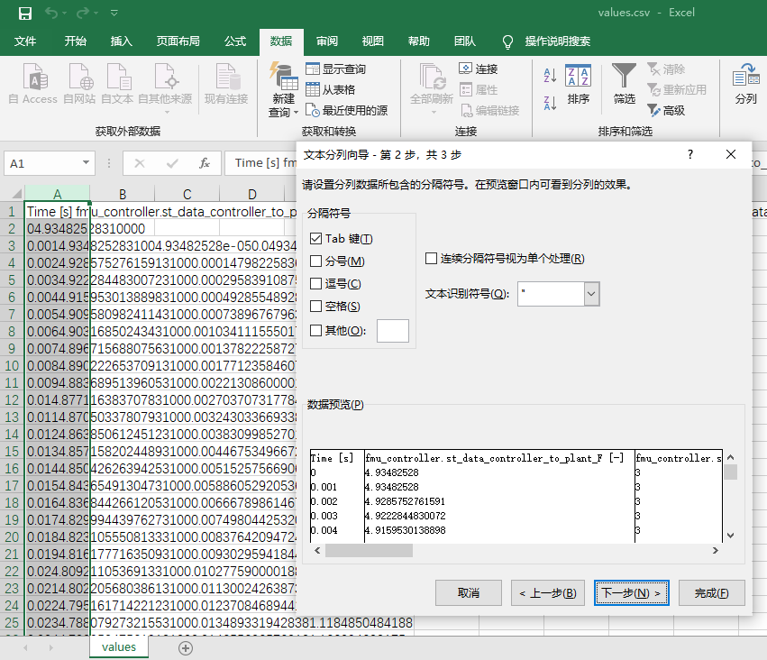

    Excel中查看结果csv数据文件

* 绘制仿真结果，验证模型的正确性，如 :numref:`fig_t_14` 。

.. _fig_t_14:
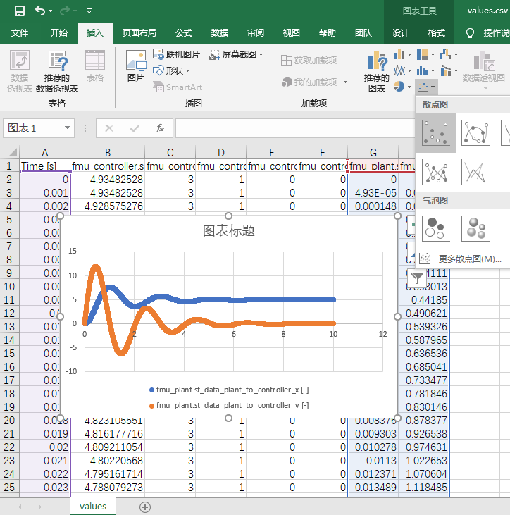

    系统时域响应曲线   

示例模型说明
=============

控制器模型为PD测速反馈控制器，如 :eq:`eq_controller` 。

.. math::
    :label: eq_controller

    F=k_p\left( r_x-x \right) -k_dv

    
被控对象为简单的一维质量块模型，如 :eq:`eq_plant` 。

.. math::
    :label: eq_plant
    
    \left[ \begin{array}{c}
    \dot{x}\\
    \dot{v}\\
    \end{array} \right] =
    \left[ \begin{array}{c}
    v\\
    \frac{F}{m}\\
    \end{array} \right] 

所组成控制系统的原理框图如 :numref:`fig_sys_all` 所示。

.. _fig_sys_all:
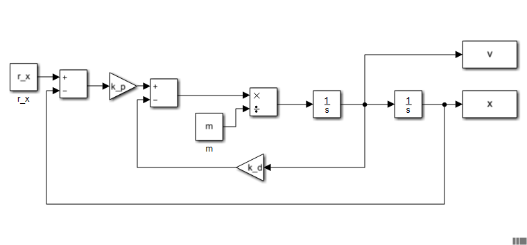

    控制系统框图

系统的传递函数为 :eq:`eq_tf` 。

.. math::
    :label: eq_tf

    \frac{X\left(s\right)}{R\left(s\right)}= \frac{ k_p \frac{1}{s} \frac{\frac{1}{ms}}{1+k_d*\frac{1}{ms}} }{ 1 + k_p \frac{1}{s} \frac{\frac{1}{ms}}{1+k_d*\frac{1}{ms}} }
    = \frac{ \frac{k_p}{ms^2+k_ds} }{ 1 + \frac{k_p}{ms^2+k_ds} }
    = \frac{k_p}{ms^2 + k_ds + k_p}
    = \frac{1}{\frac{ms}{k_p}s^2 + \frac{k_d}{k_p}s + 1}

.. math::
    :label: eq_sys

    D\left(s\right) = \frac{ms}{k_p}s^2 + \frac{k_d}{k_p}s + 1=\frac{1}{\omega_n^2}s^2 + 2\frac{\zeta}{\omega_n}s + 1

可见该反馈控制系统为典型的二阶系统，其特征方程为 :eq:`eq_sys` ，
为使得系统的响应具有较明显的动态过程，选择系统参数使得阻尼比较小且振荡频率为 :math:`0.5 \mathrm{Hz}`
即取 :math:`\zeta=0.2, \omega_n=2\pi \times 0.5` ，则系统的反馈增益为 :math:`k_p = \omega_n^2 m, k_d = 2 \zeta \omega_n m` 。
对于这个简单的模型，当然没有必要分别使用不同的仿真工具对其不同部分进行建模，
但我们为了快速验证系统运行的正确性，可以以此作为测试用例，容易给出在Simulink中的仿真结果与设计的预期相一致，如 :numref:`fig_sys_res` 。

.. _fig_sys_res:
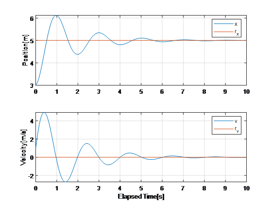

    预期的系统响应

接下来，将控制器和被控对象分别实现为两个模型，通过接口的连接实现该系统的仿真，则系统的接口关系为 :numref:`fig_sys_sep` 。

.. _fig_sys_sep:
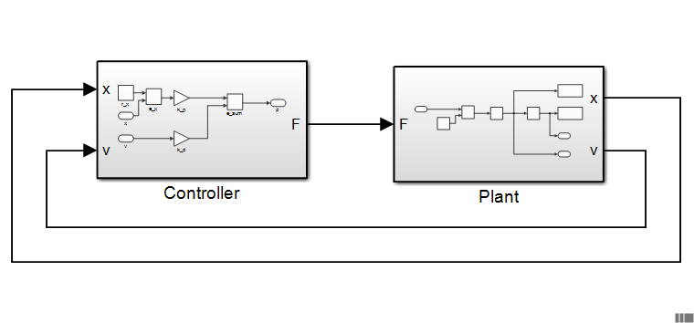

    系统的接口关系

