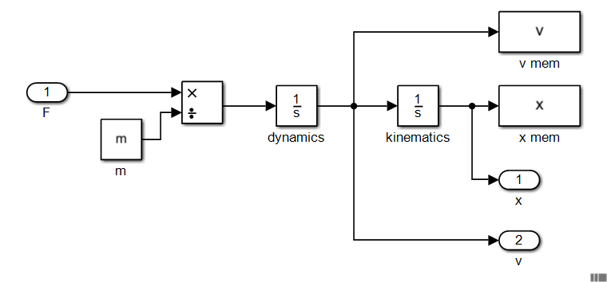

被控对象模型
-------------

为实现 :eq:`eq_plant` 中描述的被控对象模型并与控制器数学模型相连接，分解后的被控对象原理框图如 :numref:`fig_sys_plant` 。

.. _fig_sys_plant:

    被控对象原理框图

.. code-block:: C
    :linenos:

    #ifndef PLANT_H__
    #define PLANT_H__
    //==================================================================/
    // A test case for fmi simulation tools
    // Copyright (c) 2019 马玉海
    // All rights reserved.
    //
    // Version 1.0
    //==================================================================/

    #include "interface.h"

    #define FMI_MODEL_AUTHOR "MA Yuhai"
    #define FMI_MODEL_NAME "plant"
    #define FMI_MODEL_DISCRIPTION "a plant model"
    #define FMI_PORT_POSTFIX ""

    // resource file definition if any
    #define FMI_RESOURCE_ITEM 0
    #if FMI_RESOURCE_ITEM>0 && defined EN_RES_ACCESS
    const char *resource_file_list[FMI_RESOURCE_ITEM] = {
        };
    #endif
        
    #define FMI_TASK_ITEM 0
    // task definition if any in the unit of [ms]
    void task_30ms_start_0ms(void);

    // define interface variables by an fmi object
    // one statement per line, no extra semicolons allowed
    // do not modify internal variables
    typedef struct st_fmi_object_t{
        // internal variables
        FMI_IN double fmi_time_current;
        FMI_IN double fmi_time_step;
    #if FMI_RESOURCE_ITEM>0
        FMI_PRM fmi_str_ptr fmi_file_list [FMI_RESOURCE_ITEM]; // do not delete the spaces around []
    #endif
        
        // interface variables
        FMI_IN Stru_Data_Controller_To_Plant st_data_controller_to_plant;
        FMI_OUT Stru_Data_Plant_To_Controller st_data_plant_to_controller;
    }st_fmi_object;

    #endif // PLANT_H__

.. code-block:: C
    :linenos:
    
    #include "plant.h"

    double x;
    double v;
    double F;

    void* fmi_instantiate(void)
    {
        st_fmi_object *p =
            (st_fmi_object *)calloc(1, sizeof(st_fmi_object));
        if (!p) {
            fprintf(stderr, "fmi_instantiate failed in model plant!\n");
            exit(EXIT_FAILURE);
        }

        return p;
    }

    int fmi_initialize(void *fmi_object)
    {
        st_fmi_object *p = (st_fmi_object *)fmi_object;

        x = p->st_data_controller_to_plant.x_0;
        v = p->st_data_controller_to_plant.v_0;

        return 0;
    }

    int fmi_doStep(void *fmi_object)
    {
        st_fmi_object *p = (st_fmi_object *)fmi_object;
        const double m = 0.1;

        F = p->st_data_controller_to_plant.F;

        v += F / m * p->fmi_time_step;
        x += v * p->fmi_time_step;

        p->st_data_plant_to_controller.x = x;
        p->st_data_plant_to_controller.v = v;

        return 0;
    }

    int fmi_reset(void *fmi_object)
    {
        st_fmi_object *p = (st_fmi_object *)fmi_object;
        IO_PORT_FLUSH(Stru_Data_Plant_To_Controller, st_data_plant_to_controller);
        return 0;
    }

    void fmi_freeInstance(void *fmi_object)
    {
        st_fmi_object *p = (st_fmi_object *)fmi_object;

        free(p);
    }
